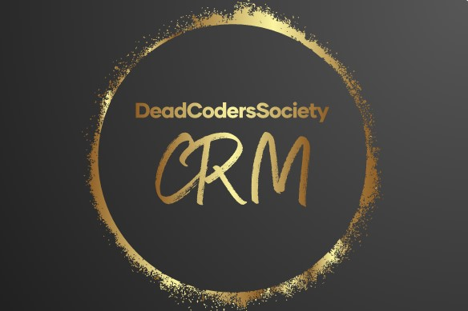

<!-- PROJECT SHIELDS -->
<!--
*** I'm using markdown "reference style" links for readability.
*** Reference links are enclosed in brackets [ ] instead of parentheses ( ).
*** See the bottom of this document for the declaration of the reference variables
*** for contributors-url, forks-url, etc. This is an optional, concise syntax you may use.
*** https://www.markdownguide.org/basic-syntax/#reference-style-links
-->
[![Contributors][contributors-shield]][contributors-url]
[![CRM][CRM-shield]][CRM-url]
[![Ironhack][Ironhack-shield]][Ironhack-url]
[![Santander][Santander-shield]][Santander-url]

<!-- PROJECT LOGO -->


<br />
<p align="center">

  <h3 align="center">CRM</h3>

  <p align="center">
    CRM project created by DeadCodersSociety team:
    <br />
    <a href="https://github.com/malgowar"><strong>Małgorzata Warczak</strong></a>
    ·
    <a href="https://github.com/VarvaraNechaeva"><strong>Varvara Nechaeva</strong></a>
    ·
    <a href="https://github.com/Mat-Poreda"><strong>Mateusz Poreda</strong></a>
    ·
    <a href="https://github.com/JerzyDan"><strong>Jerzy Danielewicz</strong></a>
  </p>


<!-- TABLE OF CONTENTS -->
<details open="open">
  <summary><h2 style="display: inline-block">Table of Contents</h2></summary>
  <ol>
    <li>
      <a href="#about-the-project">About The Project</a>
      <ul>
        <li><a href="#class-diagram">Class Diagram</a></li>
        <li><a href="#use-case-diagram">Use Case Diagram</a></li>
        <li><a href="#built-with">Built With</a></li>
      </ul>
    </li>
    <li>
      <a href="#getting-started">Getting Started</a>
      <ul>
        <li><a href="#installation">Installation</a></li>
      </ul>
    </li>
    <li><a href="#usage">Usage</a></li>
    <li><a href="#roadmap">Roadmap</a></li>
    <li><a href="#issues">Known Issues</a></li>
    <li><a href="#contributing">Contributing</a></li>
    <li><a href="#license">License</a></li>
    <li><a href="#contact">Contact</a></li>
    <li><a href="#acknowledgements">Acknowledgements</a></li>
  </ol>
</details>


<!-- ABOUT THE PROJECT -->
## About The Project

This is a project of CRM application which allow user to manage workflow of acquiring *leads* and convert them to sale *opportunities*.

Watch our promotional video:

[](https://biteable.com/watch/3222992/5eb39a67866be17856d0c8bda41fb1da)


### Class Diagram


### Use Case Diagram


#### Use Case Diagram main assumptions:
* Sales Associate cannot manually remove a lead 
* it is not possible to manually create an Account by the Sales Associate - he can change the account details only during lead conversion 
* the contact is created automatically during the lead conversion by the CRM system, and all data is collected from the lead 
* it is not possible to create an opportunity without Contact and an Account
* the Sales Director can also take part in the sales process - then he acts as a Sales Associate

### Built With

* [IntelliJ](https://www.jetbrains.com/idea/)
* [Java](https://www.java.com/en/)


<!-- GETTING STARTED -->
## Getting Started

To get a local copy up and running follow these simple steps.

### Installation

1. Clone the repo
   ```sh
   git clone https://github.com/EN-IH-WDPT-JUN21/DeadCodersSociety-ClubRickyMartin-Stage2-Homework-3.git
   ```
2. Build a new project in IntelliJ by File -> New -> Project from Version Control
3. Paste the copied URL and follow instructions.
4. Start your MySql Workbench and run the code included in db_configuration_file.sql file or copy from below:
   ```sh
   /*Creating a database*/
   CREATE DATABASE IF NOT EXISTS CRM;
   USE CRM;

   /*Creating a database user*/
   CREATE USER IF NOT EXISTS 'ClubRickyMartin'@'localhost' IDENTIFIED BY 'ClubRickyMartin123';
   GRANT ALL PRIVILEGES ON *.* TO 'ClubRickyMartin'@'localhost';
   FLUSH PRIVILEGES;
   ```
5. Run the application.


<!-- USAGE EXAMPLES -->
## Usage
<p>
Start the aplication by running Application class.
This application works on a console based user input.
<br />After starting the project you will be asked for a command. Each input has to be confirmed by presssing enter key.
<br />List of available commands can be displayed after typing help in the console.
<br />Program has built in mechanisms which format user input into recognisable commands, therefore commands like "HELP", "heLP" or "HE l P" will be accepted as long as they match the provided pattern.
<br />
<br /> Some of the commands will provide user with information, but others like "new lead" will trigger a sequence in which user will have to provide specific data.
<br /> When all the data will be provided apllication will inform You on the outcome and ask for next command.
<br /> You can exit the program by typing EXIT command.
</p>


<!-- ROADMAP -->
## Roadmap
This project is still in early development. Future functionalities are yet to be determined.

## Issues
See the [open issues](https://github.com/EN-IH-WDPT-JUN21/DeadCodersSociety-ClubRickyMartin-Homework-2/issues) for a list of known issues.


<!-- CONTRIBUTING -->
## Contributing

Contributions are what make the open source community such an amazing place to be learn, inspire, and create. Any contributions you make are **greatly appreciated**.

1. Fork the Project
2. Create your Feature Branch (`git checkout -b feature/AmazingFeature`)
3. Commit your Changes (`git commit -m 'Add some AmazingFeature'`)
4. Push to the Branch (`git push origin feature/AmazingFeature`)
5. Open a Pull Request


<!-- LICENSE -->
## License

Distributed under the MIT License. See `LICENSE` for more information.


<!-- CONTACT -->
## Contact

Project Link: [https://github.com/EN-IH-WDPT-JUN21/DeadCodersSociety-ClubRickyMartin-Stage2-Homework-3](https://github.com/EN-IH-WDPT-JUN21/DeadCodersSociety-ClubRickyMartin-Stage2-Homework-3)


<!-- ACKNOWLEDGEMENTS -->
## Acknowledgements

* [Code breaking is welcome. If you'll be able to break this application please let us know!](https://github.com/orgs/EN-IH-WDPT-JUN21/teams/deadcoderssociety)
* Test all the features! You may find something special!


<!-- MARKDOWN LINKS & IMAGES -->
<!-- https://www.markdownguide.org/basic-syntax/#reference-style-links -->
[contributors-shield]: https://img.shields.io/static/v1?label=Team&message=DeadCodersSociety&color=brightgreen&
[contributors-url]: https://github.com/orgs/EN-IH-WDPT-JUN21/teams/deadcoderssociety
[CRM-Shield]: https://img.shields.io/static/v1?label=Project&message=CRM&color=yellowgreen&
[CRM-url]: https://en.wikipedia.org/wiki/Customer_relationship_management
[ironhack-shield]: https://img.shields.io/static/v1?label=Bootcamp&message=Ironhack&color=blue&
[ironhack-url]: https://www.ironhack.com/en
[Santander-shield]: https://img.shields.io/static/v1?label=SponsoredBy&message=Santander&color=red&
[Santander-url]: https://www.becas-santander.com/en/index.html
[IntelliJ-shield]: https://img.shields.io/static/v1?label=IDE&message=IntelliJ&color=red&
[IntelliJ-url]: https://www.jetbrains.com/idea/
